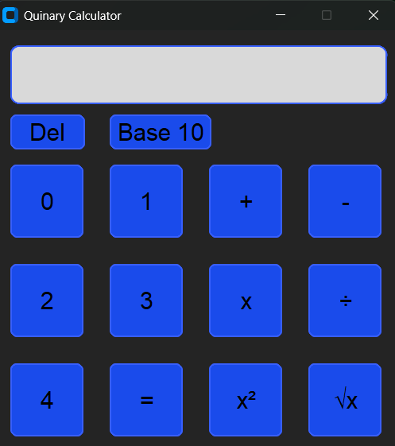

# Quinary-Calculator

## Dependencies

<li>Python >= 3.10 </li>
<li>CustomTkinter >= 5.2.2 </li>

## Manual

<li>For single operand functions:</li>
<ul>
  <li>Enter a number</li>
  <li>Press square-root or square</li>
  <li>Result is displayed in text field</li>
</ul>
<li>For double operand functions:</li>
<ul>
  <li>Enter first number</li>
  <li>Press operation symbol</li>
  <li>Enter second number</li>
  <li>Press equals button</li>
  <li>Result is displayed in text field</li>
</ul>
<li>Delete button removes a character from the end of the entry box</li>
<li>Toggle button displays the base system the display will use if toggle button is selected, not what is currently displayed.</li>

## Meetings
**9/3/2025 3:00PM**
<li>Andrew, Liam, Priscilla, James, Jason</li>
<li>RB 369</li>
<li>Discussed:</li>
<ul>
  <li>Refactoring some code</li>
  <li>Wrapping up features</li>
  <li>Small bugs</li>
</ul>

**8/30/2025 7:00PM**
<li>Andrew, Priscilla, James, Jason</li>
<li>Zoom</li>
<li>Discussed:</li>
<ul>
  <li>Tech stack: Python with CustomerTkinter as the GUI</li>
  <li>Assignments</li>
  <li>Follow-up meeting/general schedule</li>
</ul>

## Task Distribution
<li>James Ramsey = Toggle from binary to quinary feature</li>
<li>Jason Yoder = GUI frame with numbers and function buttons</li>
<li>Andrew Scott = Two number operation functions</li>
<li>Priscilla Angelina Zavala = Single number operation functions</li>
<li>Liam Grube = Unit testing, backspace feature, additional help on both sides</li>
